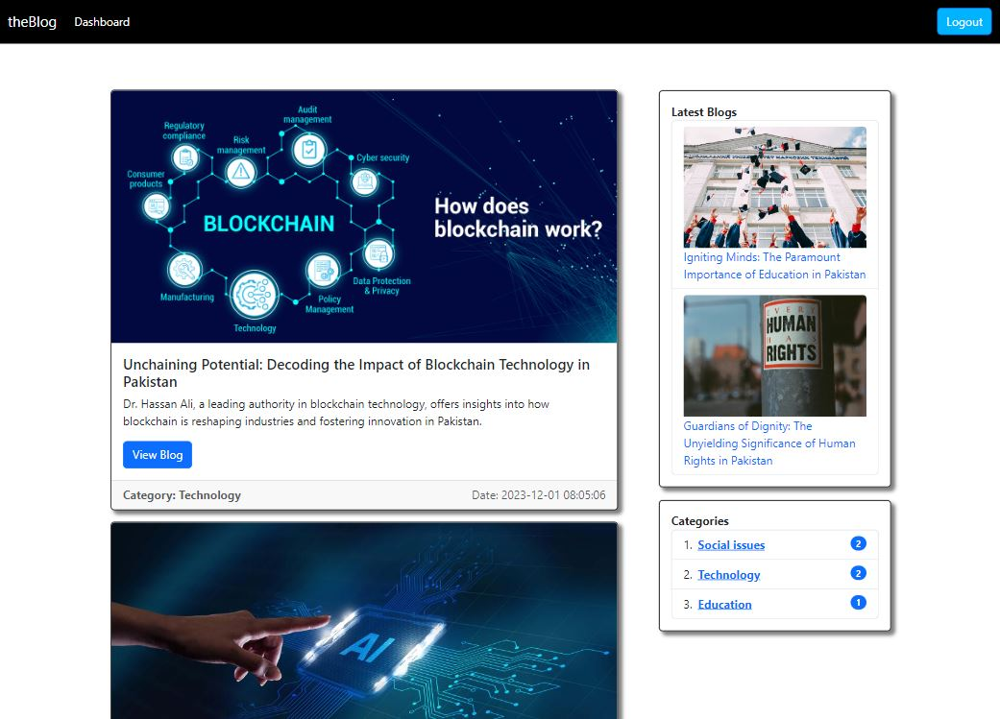
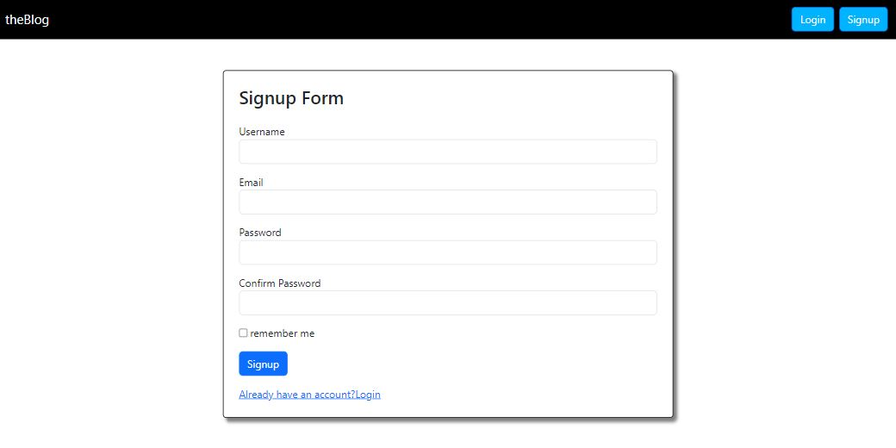
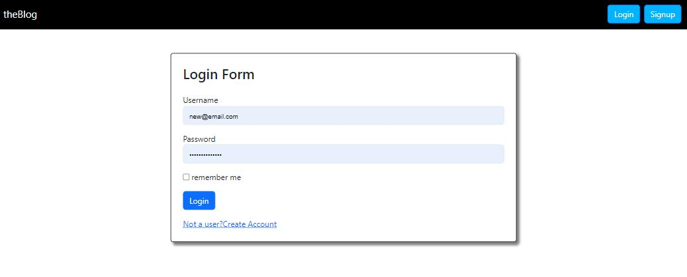
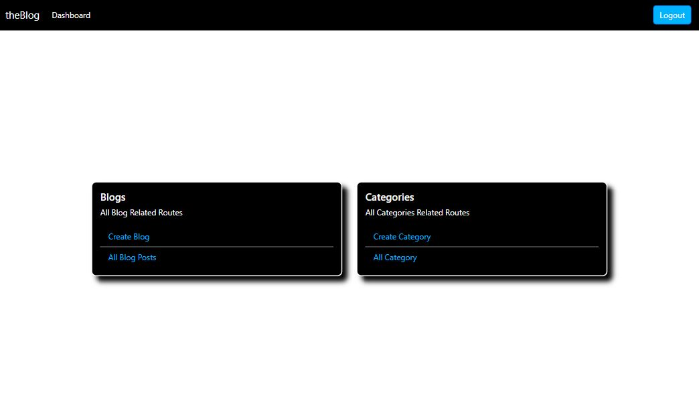
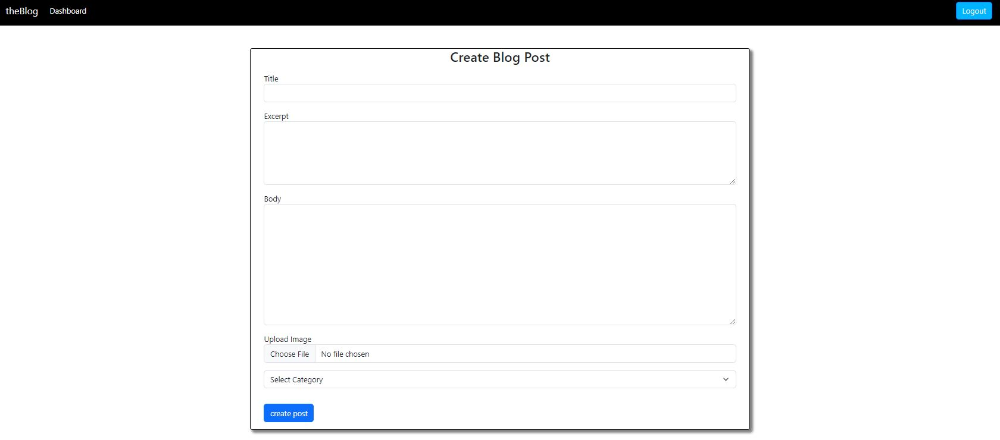
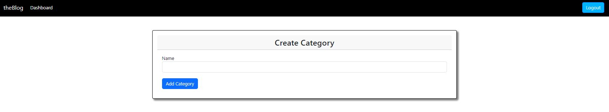
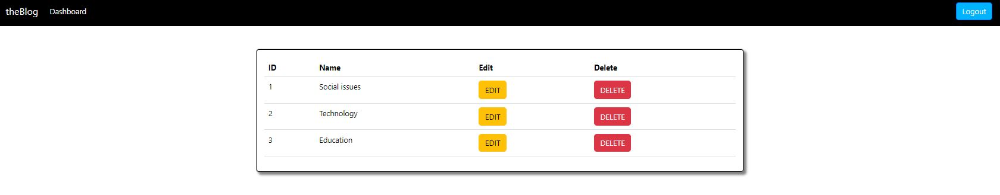

# <b>theBlog</b> - A Blog Post Application

A blog post application where users can add their own blogs. All blogs at `theBlog` Application are categorized.

## Read Blogs

Read Blogs of your choice by simply clicking on them, No matter whether you are logged in or not.

## Add Your Own Blogs
To Add and Manage your Blog posts, simply `Sign Up` or `Login` to your existing account at `theBlog`.

### <i>Sign up form</i>

### <i>Login form</i>

## User's Dashboard 

Users will get their own dashboard after logging in to their accounts.

### Create Blog

### Manage All Blogs

### Create Category

### Manage All Categories

## Give a Star⭐

Give a Star if you liked it❤️

